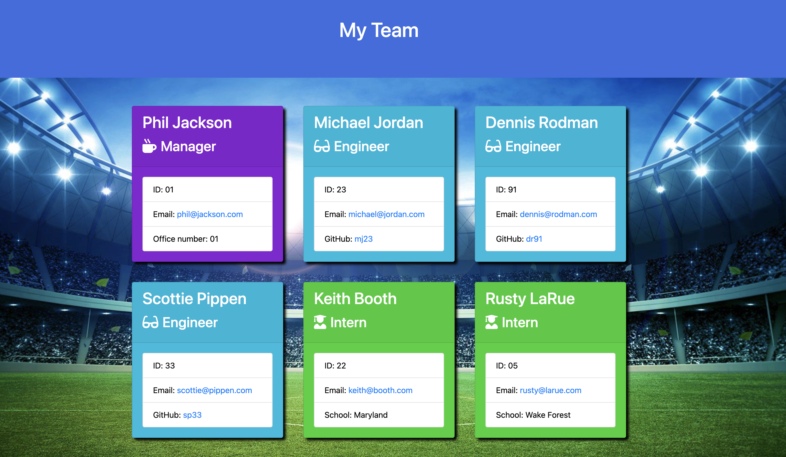
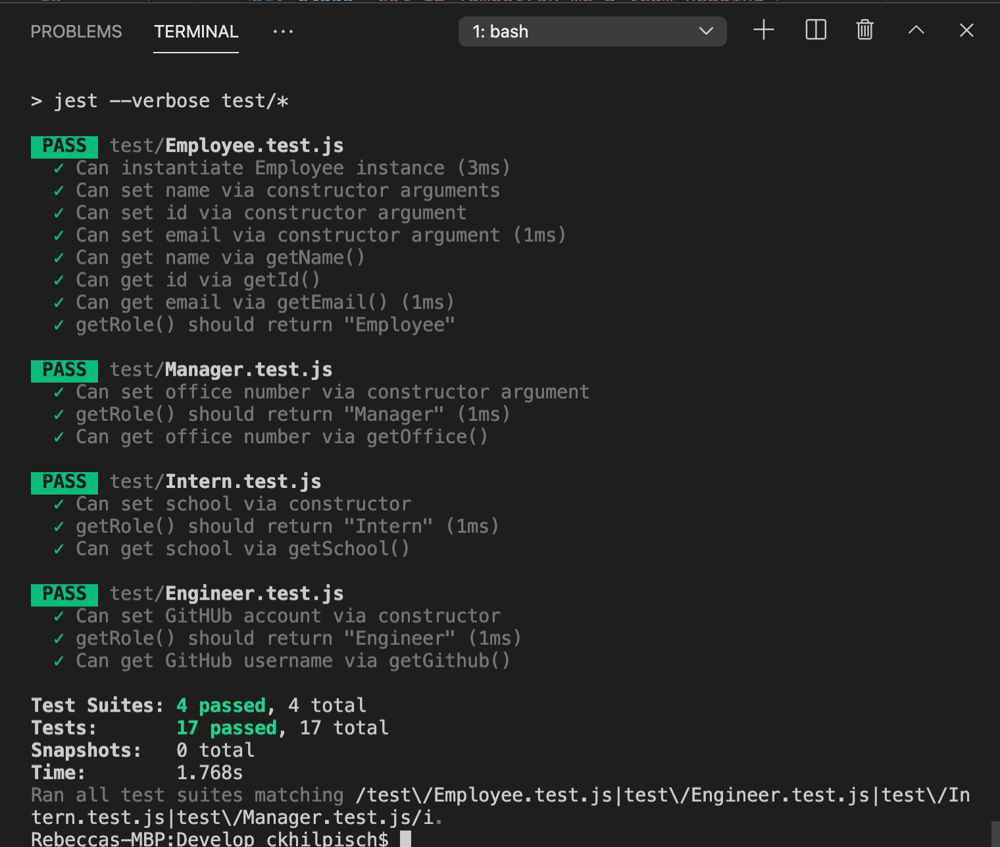

# Team Builder
## 


## Table of Contents:
<ol>
<li><a href="#description">Description</a></li>
<li><a href="#installation">Installation</a></li>
<li><a href="#usage">Usage</a></li>
<li><a href="#testing">Testing</a></li>
<li><a href="#contributing">Contributing</a></li>
<li><a href="#questions">Questions</a></li>
<li><a href="#license">License</a></li>
</ol>

## Description:


## Installation :
The application can be run in the termianl inside of your chosen coding application. It uses Javascript and Node as the languages to access it. 
The user must make sure to use the following code so that the inquirer is available to them:
```bash
npm i
```
The application is invoked by using the following command:
```bash
node app.js
```

## Usage: 
The user will open the command terminal inside the chosen coding platform.  The user will then run node app.js inside the command line.   After running that code, the user is prompted with questions about the user's team members.   After answering these questions, the user then will have a professional website that displays the user's team, along with the team member's title, name, role, id number, and information relevant to the team member based on the role the team member holds.  This information is an office number for a manager, a github link for an engineer, and a school attending for an intern.




Here is a link to a walk through tutorial of the app:


## Testing:
The application has tests in place to verify that the constructors are returing the information that is required of them.   In order to run the tests, the user can input the following in the command line:
```bash
npm run test
```
The tests should come back as either passed or failed to let the user know if the correct type of information is being gathered for each contructor and subclass of the "Employee" class.  

Here is a photo of the tests run in my application:



## Contributing

Pull requests are always welcome.  When contributing to this repository, please first discuss the change you wish to make via email or issue.  
After approval, please follow the "fork-and-pull" Git workflow.
<ol>
<li>Fork the repo on GitHub</li>
<li>Clone the project to your own machine</li>
<li>Commit changes to your own branch</li>
<li>Push your work back up to your fork</li>
<li>Submit a Pull request so that we can review your changes</li>
</ol>

## Questions :

If you have any questions, feel free to reach out to me.   My email is ckhilpisch@gmail.com.

## License :

MIT License
Informataion avaiable here: 
https://opensource.org/licenses/MIT

